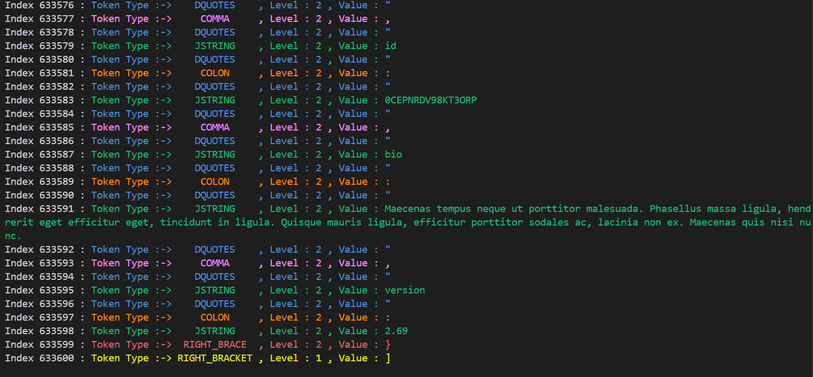
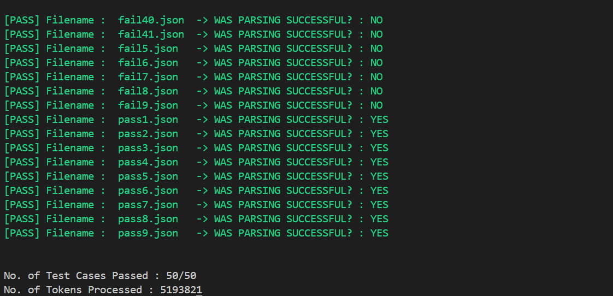

# JSON Lexer + Parser from Scratch

This project is a complete **JSON Lexer and Parser** written from scratch in Python. It takes raw JSON strings, tokenizes them into meaningful syntactic units, and parses them into **Python-native ASTs** using recursive descent logic. Will return whether the given string is a valid JSON or not.

Unlike typical off-the-shelf parsers, this solution breaks down every character and builds up the structure manually, mimicking how real interpreters work — providing clarity, control, and deep insight into how JSON syntax is understood and validated.

This project is a superset of the solution to the [Build-Your-Own-JSON-Parser](https://codingchallenges.fyi/challenges/challenge-json-parser) on Coding Challenges by John Crickett.

---

## 🚀 Features :

- **Complete Lexer + Tokenizer**  : Built a robust Lexer that can tokenize full JSON strings into custom `Token` objects, tracking nesting levels, escape characters, and quote states accurately for both readability and downstream parsing.

- **Recursive Descent Parser**  : Designed a clean and modular parser using recursive descent methods to parse complex JSON into correct Python **lists** and **dictionaries** — fully conforming to JSON standards as per [https://www.json.org/json-en.html].

- **Performance and Accuracy**  : Achieved **100% accuracy** on a rigorous test suite: Processed **50+ test cases**, Covering **500,000+ tokens** and validated against real-world JSON structures and edge cases.

- **Color-coded Token Output**  : Lexer displays token types with ANSI colors in terminal for enhanced debugging and visualization of the lexing process.

---

## 🛠️ Setup and Running Program

Follow these simple steps to run the JSON Lexer + Parser on your machine:

### 1. Clone the Repository

```bash
git clone https://github.com/brickster241/JSON-Lexer-Parser-From-Scratch.git
cd JSON-Lexer-Parser-From-Scratch
```

### 2. Run the Program

You can run the program with existing test suite :

```bash
python .\src\main.py
```

Or modify/add json files in `tests` folder with your own custom input string.

---

## ️Output

Below is an example of token list which is generated by the lexer as well as the sample testing suite:



---
